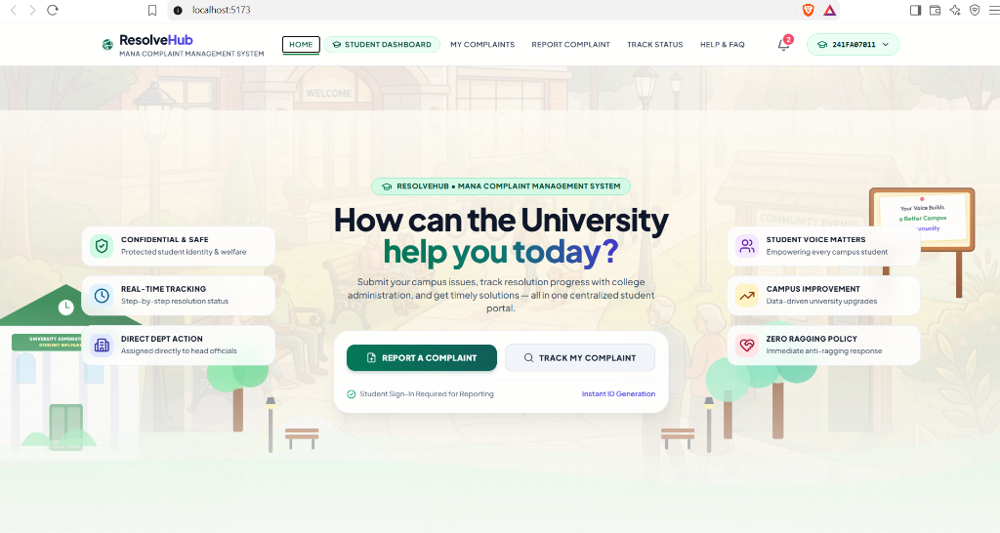
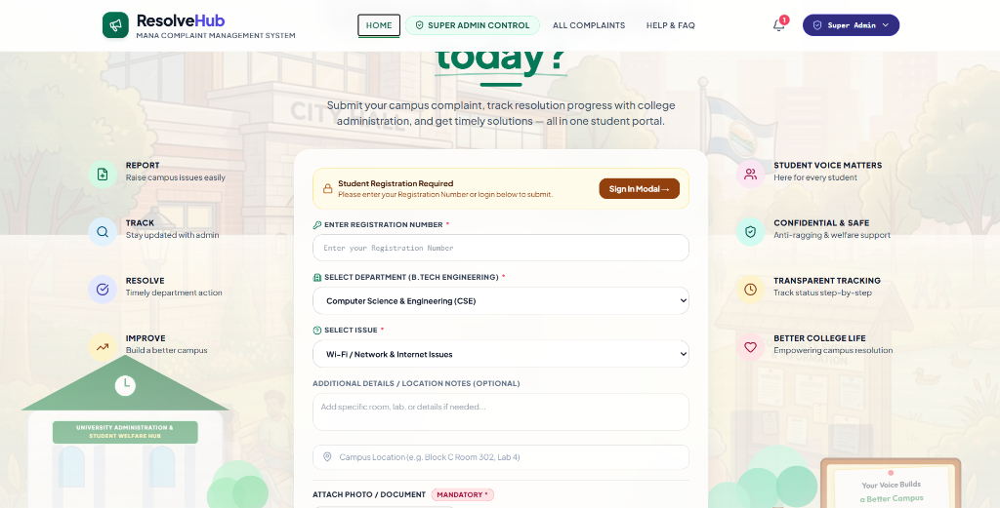
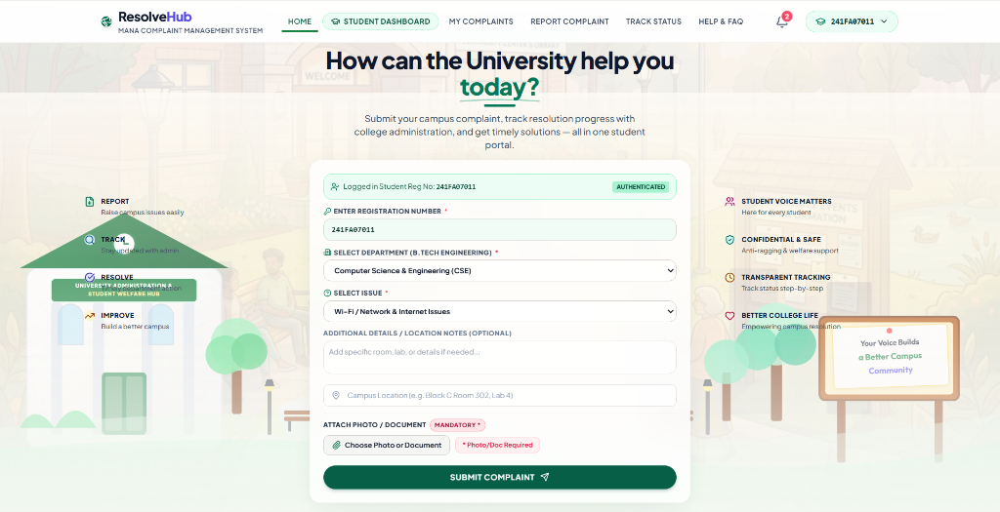

# 🎓 ResolveHub — Mana Complaint Management System



> **ResolveHub** is a state-of-the-art, full-stack University Complaint & Grievance Management System designed to bridge the communication gap between university students, Department Heads, and Super Administration. Built with React, TypeScript, Tailwind CSS, Express, and Node.js.

---

## 🌟 Key Highlights & Features

### 🏛️ 1. Student Portal & Landing Page
- **Professional Multi-Section Home Landing**:
  - **Hero Section**: Campus illustration background (`CivicCommunityBg`), ResolveHub branding, and dual CTA buttons (`REPORT A COMPLAINT` & `TRACK MY COMPLAINT`).
  - **Why ResolveHub?**: Mission statement highlighting administrative accountability, real-time progress visibility, and protected student privacy.
  - **What You Can Do**: Interactive cards leading to key features (*Report Complaint*, *Track Status*, *My Complaints*, *Notifications*, *Help & FAQ*, *Student Feedback*).
  - **How It Works (4-Step Flow)**: `Submit Complaint` → `Admin Review` → `Department Action` → `Resolution & Alert`.
  - **Supported Categories**: Academic Issues, Hostel & Housing, Wi-Fi & Internet, Infrastructure, Transport & Parking, Cleanliness & Sanitation, Security & Safety, and Student Welfare.
  - **Audit Stage Timeline**: Interactive stage cards showcasing `Pending` → `Under Review` → `In Progress` → `Resolved` → `Closed`.
  - **University at a Glance Statistics**: Dynamic stats connected directly to backend data (*Complaints Submitted*, *Issues Resolved*, *Active Departments*, *Students Supported*).
  - **Recent Campus Maintenance Updates**: Maintenance notices, Wi-Fi upgrades, library AC servicing, and evening bus schedule extensions.
  - **Student Testimonials**: Authentic feedback from CSE, ECE, and Mechanical engineering students.
  - **Frequently Asked Questions Accordion**: Expandable answers addressing submission rules, tracking, privacy, mandatory proof, and resolution process.
- **Dedicated Complaint Submission Page (`REPORT COMPLAINT`)**:
  - Student registration number verification (`241FA07011`, etc.).
  - B.Tech Department selection (CSE, ECE, MECH, CIVIL, IT, EEE, AIDS, AIML).
  - Complaint category selection and detailed location input.
  - **Mandatory Photo / Document Proof Upload**: Enforces file attachment before ticket submission.
- **Live Complaint Status Tracker**:
  - Search by unique Complaint ID (e.g., `#HUB-8492`) or registration number.
  - View current status, assigned handling officer, and official audit remarks.

---

### 🛡️ 2. Super Admin Management Dashboard


- **Centralized System Oversight**: Total complaints, pending, in-progress, resolved, rejected, and urgent complaints.
- **Global Ticket Management**: Assign tickets to department admins, update ticket status, append official audit remarks, and filter by department or category.
- **Student Signup Request Verification**:
  - Review student registration requests.
  - One-click **Approve** or **Reject** student accounts with automated notifications.
- **Department Admin Account Creation**:
  - Add new department admins (e.g. `cse_admin`, `ece_admin`) with assigned password and department.
  - Toggle active/inactive status or delete admin accounts.
- **System Activity Audit Logs & Settings**: Full operational audit trail of system activities and configurable SLA thresholds.

---

### 🏢 3. Department Admin Dashboard
- **Department-Scoped Workspace**: Automatically filtered for the logged-in Department Admin's assigned branch (e.g., Computer Science & Engineering).
- **Branch Grievance Resolution**: Update complaint status (`Pending` → `In Progress` → `Resolved`), assign field crew, and upload resolution remarks.

---

## 📸 Visual Gallery

| Section | Preview |
| :--- | :--- |
| **Student Landing Page** |  |
| **Super Admin Dashboard** |  |
| **Live Student View** |  |

---

## 🛠️ Technology Stack

- **Frontend**: React 18, TypeScript, Tailwind CSS, Lucide Icons, Vite
- **Backend**: Node.js, Express.js REST API
- **State Management & Context**: React Context API (`ResolveHubContext`)
- **Persistence**: JSON file persistence server & localStorage fallback

---

## 🚀 Getting Started (Run Locally)

### Prerequisites
Make sure you have [Node.js](https://nodejs.org/) (v18 or higher) installed on your system.

### 1. Clone & Install Dependencies
```bash
git clone https://github.com/your-username/complaint11.git
cd complaint11
npm install
```

### 2. Start Backend Server
In one terminal window, run the Express backend API server:
```bash
node server/index.js
```
*Backend server will start running at `http://localhost:3001`.*

### 3. Start Frontend Dev Server
In a second terminal window, run the Vite dev server:
```bash
npm run dev
```
*Frontend app will start running at `http://localhost:5173`.*

### 4. Build for Production
To test production TypeScript compilation and build output:
```bash
npm run build
```

---

## 🔑 Test Credentials (Role-Based Access Control)

| Role | Username / Identifier | Password | Access Rights |
| :--- | :--- | :--- | :--- |
| **Super Admin** | `superadmin` | `admin123` | Complete control over all departments, signup approvals, and admin accounts |
| **Dept Admin (CSE)** | `cse_admin` | `admin123` | Department-level management for CSE complaints |
| **Student** | `241FA07011` | `student123` | Report complaints, track live status, view personal history & notifications |

---

## 📁 Project Structure

```
complaint11/
├── server/
│   ├── index.js             # Express API Server & Data Persistence
│   └── data.json            # Central JSON Database Storage
├── src/
│   ├── components/
│   │   ├── HomePage.tsx               # Main Student Landing Page with Multi-Sections
│   │   ├── HeroSection.tsx            # Dedicated Complaint Submission Form
│   │   ├── Navbar.tsx                 # Responsive Header with Navigation & Dropdowns
│   │   ├── SuperAdminDashboard.tsx    # Super Admin Dashboard & Registration Verification
│   │   ├── DeptAdminDashboard.tsx     # Department Admin Resolution Workspace
│   │   ├── StudentDashboard.tsx       # Student Profile Dashboard & Notifications
│   │   ├── TrackStatusSection.tsx     # Live Complaint Status Tracker
│   │   ├── MyComplaintsSection.tsx    # Student Complaints History
│   │   └── CivicCommunityBg.tsx       # Campus Vector Artwork Background
│   ├── context/
│   │   └── ResolveHubContext.tsx      # Global Context State & API Service Integration
│   ├── services/
│   │   └── api.ts                     # REST API Client Service Layer
│   ├── types/
│   │   └── index.ts                   # TypeScript Interfaces & Data Contracts
│   ├── App.tsx                        # Master App Layout & View Routing
│   └── main.tsx                       # React DOM Application Entrypoint
├── public/
│   └── screenshots/                   # Application Screenshots & Documentation Assets
└── README.md                          # Project Documentation
```

---

## 📜 License & Acknowledgements
Built for University Campus Infrastructure & Student Welfare Management. All rights reserved © 2026 **ResolveHub Team**.


# ResolveHub

University Complaint & Grievance Management System.

## 🌐 Live Demo

[Visit ResolveHub Live Website](https://resolve-hub-seven.vercel.app/)

## 🚀 Tech Stack

- React
- TypeScript
- Tailwind CSS
- Node.js
- Express.js
- Vercel
- Render

## 🌐 Live Demo

🔗 https://resolve-hub-seven.vercel.app/