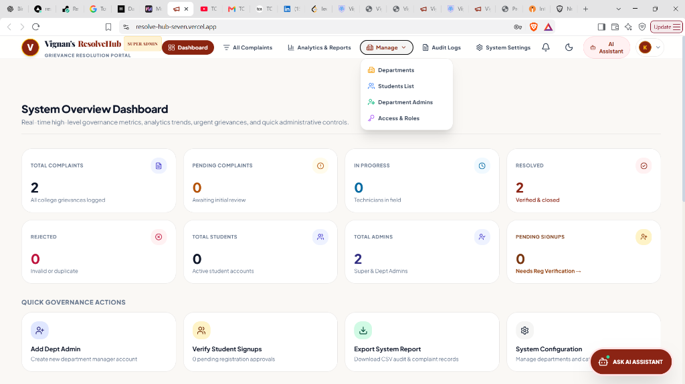
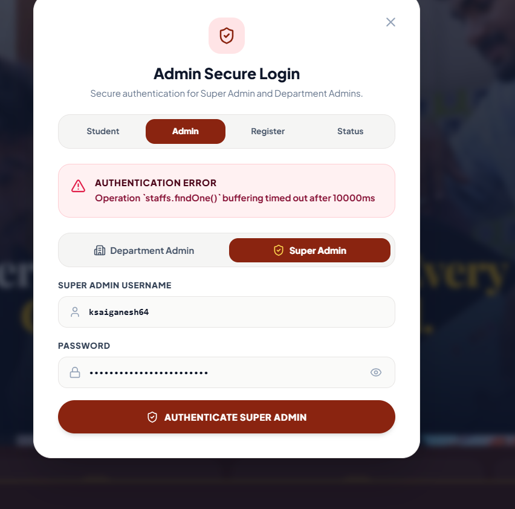
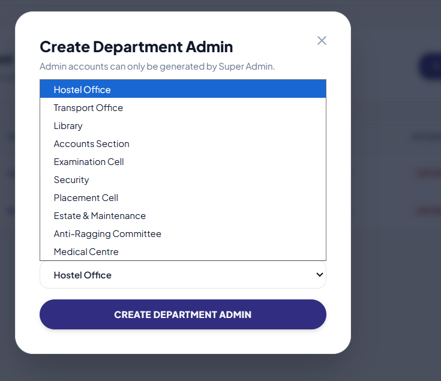
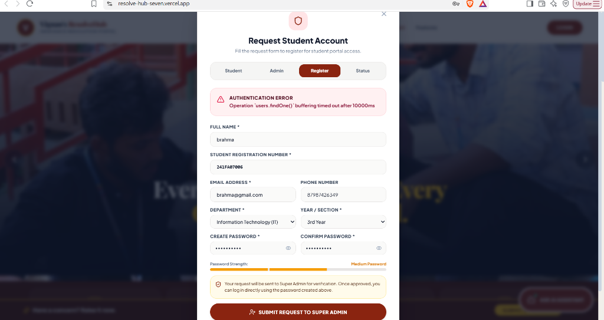
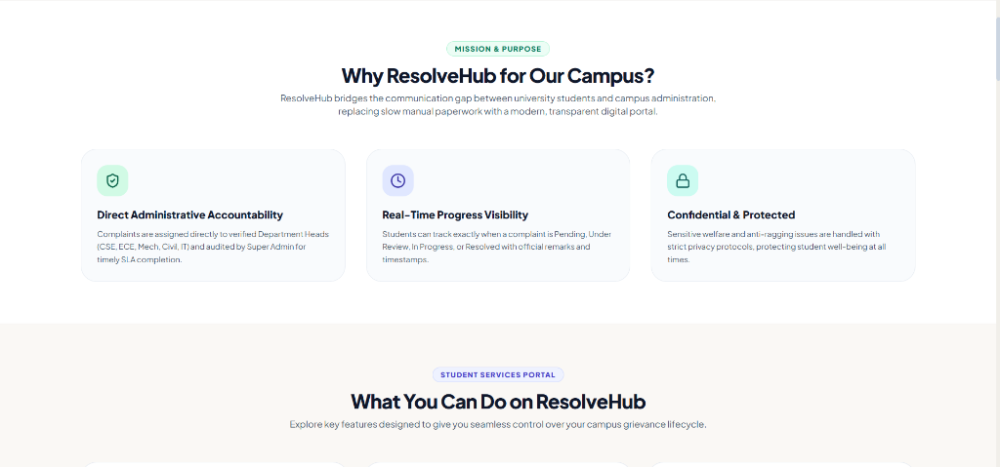
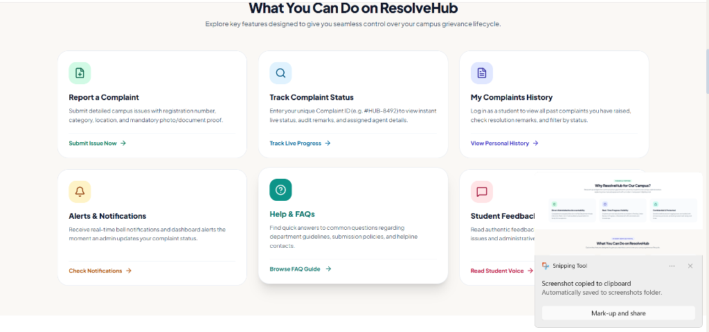

# 🎓 Vignan's ResolveHub — University Grievance Resolution Portal

[](https://resolve-hub-seven.vercel.app/)
[](https://reactjs.org/)
[](https://www.typescriptlang.org/)
[](https://tailwindcss.com/)
[](https://expressjs.com/)
[](https://www.mongodb.com/)
[](https://socket.io/)

> **Vignan's ResolveHub** is an enterprise-grade, full-stack University Grievance & Student Welfare Resolution Portal. Built for **Vignan University**, it connects students, department administrators, and system super administrators into a unified, full-screen, edge-to-edge governance ecosystem.

---

## 🌐 Live Web Application

🔗 **[https://resolve-hub-seven.vercel.app/](https://resolve-hub-seven.vercel.app/)**

---

## 📸 Application Screenshots & Visual Gallery

### 🏛️ 1. Super Admin Overview Dashboard & Manage Navigation Header

*Super Admin governance header featuring the **Manage** dropdown menu with direct links to **Student Requests**, **Students List**, **Departments**, **Department Admins**, and **Access & Roles**.*

---

### 🌐 2. Full-Width Edge-to-Edge Campus Grievance Portal

*Full-screen responsive hero section featuring Vignan University branding, campus image carousel, and instant grievance action shortcuts.*

---

### 📝 3. Student Registration & Account Verification Hub

*Dedicated Student Signup Verification Hub with distinct tab filters for **Pending Requests**, **Accepted / Approved**, **Rejected Requests**, and **All Signup Requests**.*

---

### 📎 4. Multi-File Evidence Attachments & Image Lightbox Preview

*Comprehensive evidence attachments pipeline featuring image Lightbox modal preview, PDF/document download buttons, and physical file unlinking on ticket deletion.*

---

### 📑 5. Grievance Submission Form

*Student intake form supporting registration number verification, category & department assignment, location details, and multipart file upload.*

---

### ⏱️ 6. Student Dashboard & SLA Resolution Stepper

*Student dashboard displaying real-time grievance tracking with audit stage progress stepper, field technician assignment, and official response remarks.*

---

### 📊 7. Department Analytics & Performance Reports

*Visual breakdown of complaint volume by department, priority distribution, and SLA resolution compliance metrics.*

---

## 🌟 Key Features & Architectural Highlights

### 🛡️ 1. Password-First Security Authentication
- **Secure Password-First Verification**: On student login attempts, the backend verifies the submitted password against the stored bcrypt hash **FIRST** before inspecting account status (`PENDING`, `REJECTED`, `INACTIVE`).
- **Student Self-Registration & Approval**: Students register using their registration number and details. Requests undergo Super Admin approval.

---

## 🔑 Default Credentials (Role-Based Access Control)

| Role | Username / Reg No | Password | Permissions & Rights |
| :--- | :--- | :--- | :--- |
| 👑 **Super Admin** | `ksaiganesh64` | `SAI@@@killer197712200611` | Complete system control, student request verification, admin creation, system settings & audit logs |
| 🎓 **Student Account** | Registered Reg No | Student Password | Submit grievances, attach media evidence, track live progress, view student dashboard |
| 🏢 **Dept Admin (CSE)** | `dept_cse` | `admin123` | Department-scoped inbox, assign field technicians, update status & audit remarks |

---

## 🛠️ Technology Stack

- **Frontend**: React 18, TypeScript, Tailwind CSS, Lucide React Icons, Vite
- **Backend API**: Node.js, Express.js REST Framework
- **Database**: MongoDB Atlas / Local MongoDB fallback with Mongoose ODM
- **Real-Time Engine**: Socket.io Server & Client
- **Authentication**: JSON Web Tokens (JWT) + Bcrypt password hashing
- **File Storage**: Multer multipart middleware with static `/uploads` serving

---

## 📡 API Endpoint Reference

### 🔐 Authentication & Student Registration
- `POST /api/v1/auth/login` — Authenticates Super Admin, Dept Admin, or Student (Password-First).
- `POST /api/v1/auth/signup-request` — Submits new student account registration request.
- `GET /api/v1/auth/signup-requests` — Fetches all registration requests (Super Admin only).
- `POST /api/v1/auth/signup-requests/:id/approve` — Approves signup request & activates student account.
- `POST /api/v1/auth/signup-requests/:id/reject` — Rejects signup request with reason.
- `DELETE /api/v1/auth/signup-requests/:id` — Deletes signup request record.
- `GET /api/v1/auth/students` — Fetches active student accounts database.
- `DELETE /api/v1/auth/students/:id` — Removes student account and associated signup records.
- `POST /api/v1/auth/students/:id/reset-password` — Super Admin student password reset.

### 📋 Grievances & Complaints
- `GET /api/v1/tickets` — Fetches complaints with role, department, and category filtering.
- `POST /api/v1/tickets` — Submits new complaint with multipart file attachments (`files`).
- `GET /api/v1/tickets/track/:id` — Public ticket status tracking by Complaint ID.
- `PATCH /api/v1/tickets/:id/status` — Updates ticket status & appends official response remarks.
- `PATCH /api/v1/tickets/:id/assign` — Assigns field technician/officer to ticket.
- `DELETE /api/v1/tickets/:id` — Deletes complaint and physically unlinks attached files.

---

## 🚀 Running Locally

### Prerequisites
- [Node.js](https://nodejs.org/) (v18 or higher)
- [MongoDB](https://www.mongodb.com/) (Local server or MongoDB Atlas cluster URI)

### 1. Clone & Install Dependencies
```bash
git clone https://github.com/Ganesh-commit/ResolveHub.git
cd complaint11

# Install Root / Frontend dependencies
npm install

# Install Server dependencies
cd server
npm install
cd ..
```

### 2. Configure Environment Variables
Create a `.env` file inside the `server/` folder (or copy `server/.env.example`):
```env
PORT=3001
MONGODB_URI=mongodb://127.0.0.1:27017/resolvehub
JWT_SECRET=vignan_resolvehub_super_secret_jwt_key_2026
SUPERADMIN_USERNAME=ksaiganesh64
SUPERADMIN_PASSWORD=SAI@@@killer197712200611
DEMO_STUDENT_REG_NO=241FA07011
DEMO_STUDENT_PASSWORD=241FA07011
```

### 3. Start Backend Express Server
```bash
cd server
npm start
```
*Server starts on `http://localhost:3001` and seeds initial Super Admin & Demo Student.*

### 4. Start Frontend Dev Server
In a separate terminal window:
```bash
npm run dev
```
*Vite dev server starts on `http://localhost:5173`.*

### 5. Run Backend Automated Test Suite
```bash
cd server
npm test
```

---

## 📜 License & Ownership

Developed for **Vignan's Foundation for Science, Technology & Research (Vignan University)**. All rights reserved © 2026 **ResolveHub Development Team**.